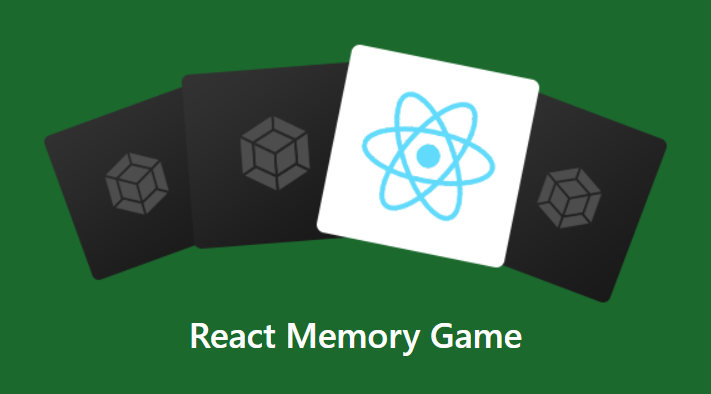

# 🎲🧠 React Memory Game
Игра Memory с использованием библиотеки для разработки пользовательских интерфейсов React.

<p align="center">
  
</p>


Онлайн игра достпуна по ссылке: [DEMO](http://shevchux.github.io/react-memory-game).

## 🏎️ Запустить локально
* Установить [Node](http://nodejs.org/download/). Должна быть доступна команда `npm`
* Клонировать проект
* Перейти в папку с клинированным проектом
* Установить зависимости
```
npm install
```
После просто запустите проект
```
npm start
```
Браузер откроет проект по адресу ```http://localhost:8080/```